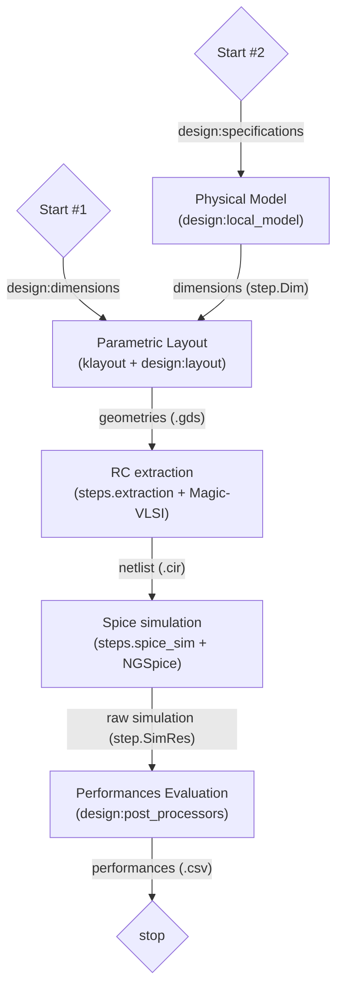

# HAADIC

**Highly-Automated Analog Designer for Integrated Circuits**

This project is a prototype. Its goal is to create a technological and
software-agnostic design flow, from device sizing to layout and implementation.

## Installation

This application needs nix, uv and python3. For windows, please install NixOS as shown [here](https://nixos.wiki/wiki/WSL).

Installation using [uvx](https://docs.astral.sh/uv/getting-started/installation/) is recommended.

The following command check if everything is correctly setup :

```shell
uvx --with="git+https://github.com/Patarimi/haadic.git" haadic smoke-test
```

## Creating a new Project

A directory with the required files can be generated using :

```shell
haadic new
```

## GDS Generation

First update the layout fonction in the design.py file created in the previous step. Some helpfull fonctions can be found in [design:layouts](reference/haadic/design/layouts/index.md).
Then run the following command :

```shell
uv run --script design.py
```

The [Design flow](#design-flow) is run.

Dimensions in the layout can be changed by editing the `dim` variable.
Post-simulation computation can be done by editing the `evaluate` function.

## Design Flow

The following flow is run using the informations given in a _design_ python file (See [Setup a new Project](#creating-a-new-project)). The flow has 2 entry points :

- `flow.run_from_dim` : Only requires a `dim` variables which defines the value of each parameters of the layout function.
- `flow.run_from_target` : Requires both a `target`and an `local_model` function. The `local_model` is an implementation of the design methodology which output the layout parameters value required to obtains the `target`.



When finished, a _.gds_ file is available for further design and a _.csv_ file with the performances of the design.

## PDKs configuration

A techno.json file can be created in the working dir or the haadic root with the following structure:

```json
{
"techno_name": {
  "base_dir": "path to the pdk directory root",
  "layermap": "path to the layermap (relative to the base_dir)",
  "techlef": "path to the tlef file",
  "magic_rc": "path to the configuration file of magic",
  "lib_spice": "path to the spice model library",
  "section": "name of the section to import in the spice library typical",
  "source_url": "url to be use for download (set to "ciel" for ciel installation)",
  "version": "version id (only required if source_url is set to "ciel")"
}
}
```

A techno.json file with three open source PDK and a mock PDK are already supplied.

## For developpers

Install haadic with optional group dev :

```shell
uv install git+https://github.com/Patarimi/haadic --with dev
```

Then run pytest in a shell

```shell
uvx run poe test
```
