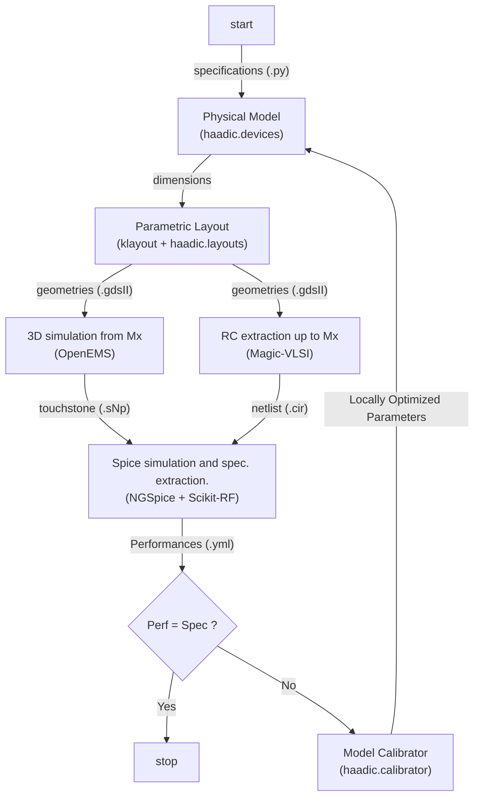

# HAADIC

**Highly-Automated Analog Designer for Integrated Circuits**

This project is a prototype. Its goal is to create a technological and
software-agnostic design flow, from device sizing to layout and implementation.

## How to get started

This application needs nix and python3. For windows, please install NixOS as shown [here](https://nixos.wiki/wiki/WSL).

Installation using [uvx](https://docs.astral.sh/uv/getting-started/installation/) is recommended.

The following command check if everything is correctly setup :

```shell
uvx --with="git+https://github.com/Patarimi/haadic.git" haadic smoke-test
```

## Design flow

Starting from the specifications written in a python file, the following flow is run [see](#setup-a-new-project).



When finished, a _.gds_ file is available for further design.

## PDKs configuration

A techno.yml file can be created in the working dir or the haadic root with the following structure:

```yaml
techno_name:
  base_dir: path to the pdk directory root
  layer_map: path to the layermap (relative to the base_dir)
  techlef: path to the tlef file
  magic_rc: path to the configuration file of magic
  source_url: url to be use for download (set to "ciel" for ciel installation)
  version: version id (only required if source_url is set to "ciel")
```

A techno.yml file with three open source PDK and a mock PDK are already supplied.

## Setup a new Project :

A directory with required files can be generated using :

```shell
haadic new
```

## Tests configuration

Install haadic with optional group dev :

```shell
uv install git+https://github.com/Patarimi/haadic --with dev
```

Then run pytest in a shell

```shell
uvx run poe test
```
